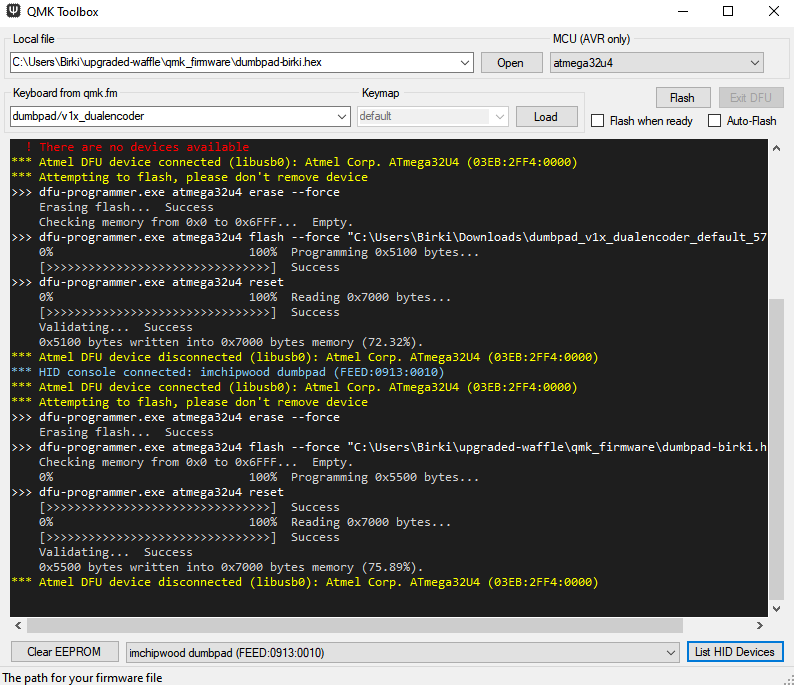

# QMK ⌨

Modified for the `upgraded-waffle` 🧇

## Usage

To use the `./run.sh` command, please ensure you have the following installed and ready to use:

- Docker
- Docker-compose
- Some flavor of bash (WSL or native Linux)

Tip: If you are on windows, you can follow this official guide to install all of the above -> [guide](https://docs.docker.com/docker-for-windows/install/)

### Steps

1. From this directory, run the following command: `./run.sh`
2. Follow the prompts - Example: `-kb: dumbpad` and `-km birki`
3. Check for the output hex file in this directory. Example: `dumbpad-birki.hex`
4. 🎉

#### Explanation

The following steps above just built a Docker container. This docker container copied all the files from this directory and attached a volume to write the file back into our repo. It then built and compiled the keyboard/macro we provided during runtime. This is fed through `qmk compile` and then saved to our working directory as `<filename>.hex.output`. It is then renamed to remove the `.output` to use it within QMK Toolbox for flashing.

### Installing my custom keymap

> These are my own instructions for installing my custom keymap

My custom keymaps are located here: [birki](keyboards/dumbpad/v1x_dualencoder/keymaps/birki/keymap.c)

Edit the keymap to your liking and then run the command below:

```bash
$ ./run.sh
Enter Keyboard (Ex: dumbpad) -kb: dumbpad
Enter Keymap (Ex: default) -km: birki
```

Open QMK Toolbox and flash using the hex file compiled and stored in this directory:



> In my case, the compiled hex file is named `dumbpad-birki.hex`

### Bonus Notes

I needed to re-installed QMK Toolbox, run it as administrator and installed all drivers. I even had to reboot my PC once to finish the install I think.

Then after a second reboot, I installed drivers (again) and was able to flash my dumbpad. There is a little button thingy I had to press to get it into flashing mode.

Because this is all so foreign to me, I even removed my actual keyboard to avoid the risk of destroying it on accident.

Speaking about my actual keyboard, that doesn't quite work yet for this project. I did at one point but that was years ago and I forget why it doesn't work now. This file `qmk_firmware/keyboards/dztech/dz60rgb_ansi/keymaps/default/keymap.c` is empty with `<removed>` and it just fails 🤷‍♂️.

At some point, if my main keyboard dies, I will need to fully rebuild this project and make it actually usable for my keyboard. I will certainly keep the current docker build setup as it is quite nice. I can build a `.hex` file for my dumbpad on a mac, copy it to my windows device, boot up QMK, and still get a successful flash. So that is cool.
